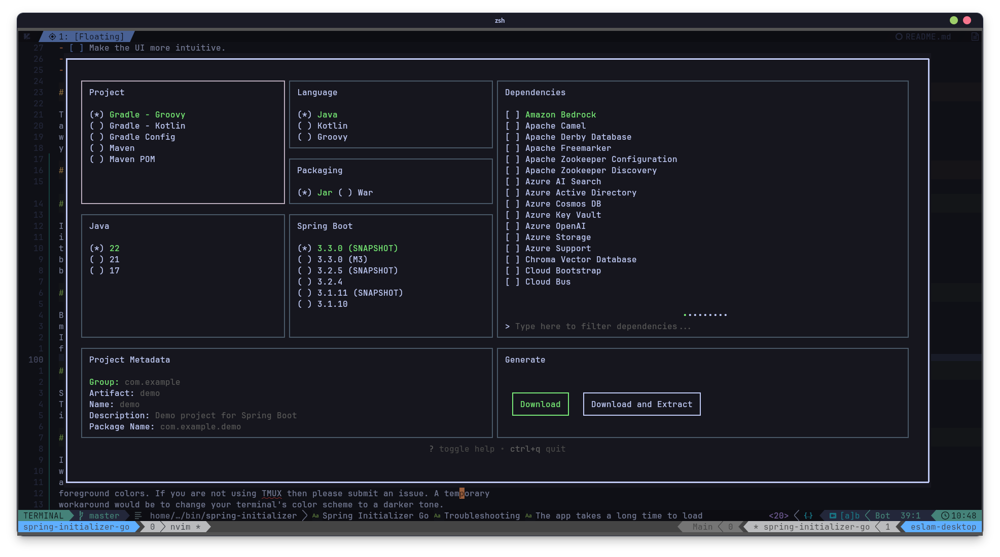

# Spring Initializer Go

A [Spring Initializer](https://github.com/spring-io/start.spring.io) client
written in Go.



## Motivation

As a software developer, I frequently found myself writing extensive code,
leading to discomfort and wrist pain. Seeking solutions, I explored ways to
reduce mouse usage. Transitioning many aspects of my workflow to the terminal
proved both comfortable and efficient.

However, during the initiation of a new Java project, I encountered a roadblock:
the absence of a terminal-based user interface (TUI) version of **Spring
Initializr**. Determined to bridge this gap, I embarked on creating a solution
tailored to my needs.

## Installation

### Manual

Clone the repository and run: `make compile-current` or `go build ./cmd/spring-initializer/`
in the root of the repository.

### Go install (Recommended)

#### Prerequisites

- [Golang](https://go.dev/doc/install)

```bash
go install github.com/eslam-allam/spring-initializer-go/cmd/spring-initializer@latest
```

### Pre Compiled Binary

You can also grab one of the pre-compiled binaries from the
[Releases Section](https://github.com/eslam-allam/spring-initializer-go/releases)
and place it in a folder currently in PATH.

> Compiled binaries may not always be up to date so if you want the latest
> features, the other methods are recommended.

## Usage

This app has a similar interface to official [Web Spring Initializer](https://start.spring.io/).
Just run the app using `spring-initializer` and you will be able to see a list of
available key maps at the bottom of the screen.

You may also pass the target directory as a positional command line argument as
follows:

```bash
spring-initializer 'some-directory/some-other-directory' # Relative directory
```

```bash
spring-initializer '/home/eslamallam/personal_projects/java/something' # Absolute directory
```

```bash
spring-initializer '~/projects/spring' # ~ will be expanded to $HOME
```

The directory will be created if it doesn't exist.

## Todo

- [x] Add ability to pick project folder.
- [ ] Add description to dependency entries.
- [ ] Make the UI more intuitive.
- [ ] Refactor this unsightly code.
- [ ] Add confirmation message when creating a new project.

## Issues

This project was mainly created to make my workflow more convenient but tickets
are more than welcome. If you encounter any crashes or if there's something you
wish was done differently, don't hesitate to open an issue or PR if you think
you can handle it yourself.

## Troubleshooting

### Resizing the terminal window scrambles the look of the app

If you are using windows then unfortunately the app won't automatically resize
itself as windows doesn't send size change events. My recommendation is to set
the size of the terminal to a suitable size
before launching the app. I currently don't have a solution for this limitation
but hopefully will find a workaround in the future.

### The app takes a long time to load

Before the app launches, it sends a request to spring.io to fetch necessary
metadata. This step is needed to display the various options you can select.
I'm currently working on adding a loading screen for this step in the near
future.

### The text is really small/unreadable

Since this is a terminal-based app, it uses your terminal's font.
Try changing your terminal's font or increase the font size. The preview up top
is using JetBrains Mono with size 12.

### Color contrast is poor

If you are using TMUX, it's currently not possible to change the terminal's color
when launching the app while ensuring the terminal goes back to it's original state
after quitting. In that case the app will inherit your terminal's background and
foreground colors. If you are not using TMUX then please submit an issue. A temporary
workaround would be to change your terminal's color scheme to a darker tone.

## Contributing

If you have a feature you believe should be added and you wish to tackle it yourself,
make a fork of this repo and submit a PR once you`re done. It's recommended to submit
an issue first to make sure this is something that would benefit the project to
not waste your efforts.
