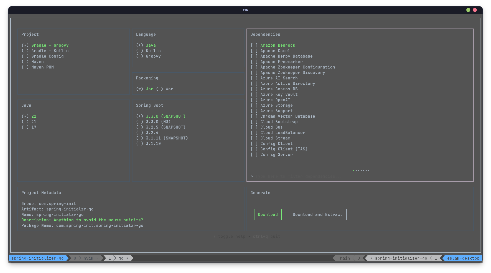

# Spring Initializer Go

A [Spring Initializer](https://github.com/spring-io/start.spring.io) client
written in Go.



## Motivation

As a software developer, I frequently found myself writing extensive code,
leading to discomfort and wrist pain. Seeking solutions, I explored ways to
reduce mouse usage. Transitioning many aspects of my workflow to the terminal
proved both comfortable and efficient.

However, during the initiation of a new Java project, I encountered a roadblock:
the absence of a terminal-based user interface (TUI) version of **Spring
Initializr**. Determined to bridge this gap, I embarked on creating a solution
tailored to my needs.

## Installation

### Manual

Clone the repository and run: `make compile-current` or `go build ./cmd/spring-initializer/`
in the root of the repository.

### Go install

#### Prerequisites

- [Golang](https://go.dev/doc/install)

```bash
go install github.com/eslam-allam/spring-initializer-go/cmd/spring-initializer@latest
```

### Pre Compiled Binary

You can also grab one of the pre-compiled binaries from the
[Releases Section](https://github.com/eslam-allam/spring-initializer-go/releases)
and place it in a folder currently in PATH.

## Usage

This app has a similar interface to official [Web Spring Initializer](https://start.spring.io/).
Just run the app using `spring-initializer` and you will be able to see a list of
available key maps at the bottom of the screen.

## Todo

- [ ] Add ability to pick project folder.
- [ ] Add description to dependency entries.
- [ ] Make the UI more intuitive.
- [ ] Refactor this unsightly code.

## Issues

This project was mainly created to make my workflow more convenient but tickets
are more than welcome. If you encounter any crashes or if there's something you
wish was done differently, don't hesitate to open an issue or PR if you think 
you can handle it yourself.
